**Präferenzabfrage-Tool**
<br>
<br>
<br>


<!--Logo--->
<div align="center">
    
  </a>
</div>

 <h4>Das Auslandssemester-Präferenztool ist eine interaktive Plattform, die es Studierenden ermöglicht, ihre bevorzugten Partneruniversitäten für das MESS-Bachelor-Auslandssemester auszuwählen. Das Tool ermöglicht es den Studenten, ihre Präferenzen für ihe bevorzugte Univrsität für das Auslandssemester in absteigender Reihenfolge zu wählen. Gleichzeitig gewährleistet es Transparenz im Auswahlprozess und ermöglicht es den Admins, Auswahlverfahren zu gestalten und diese zu bearbeiten.</h4>


<h2>Wichtiges beim Klonen</h2>
Bei dieser Entwicklung wurde mit einer lokalen SQL Datenbank gearbeitet. Beim Klonen muss dies unbedingt beachtet werden und eine eigene Datenbank erstellt werden, damit die Daten, die man z.B in den Whitelists erstellt, auch nach dem Schließen der App noch gespeichert werden. Anschließend muss man die jeweiligen URL-Stellen im Code durch die URL der eigenen Datenbank ersetzen.
<br>
Außerdem muss die Datenbank(welche man in dem Ordner "DatenBank" im Spring Boot Ordner starten kann) <strong>separat gestartet werden!</strong> Dies geht, in dem man die Main Klasse im src Ordner startet. 
Ansonsten bekommt man bei der App Fetch Errors und man kann keine CRUD Operationen(Erstellen, Hinzufügen, Löschen und Bearbeiten) ausführen.

<br>
<br>
<br>

### Benutzte Technologien
[](https://skillicons.dev)<br>
<br>
Als CSS Framework haben wir uns für React-Bootstrap entschieden, da dieses Framework über eine sehr umfangreiche Dokumentation verfügt und so optimal für ansprechende Website Designs ist.

<br>
<br>
<h1>Applikation aufsetzen</h1>

In diesem Abschnitt wird beschrieben, wie man das Projekt auf dem eigenen Rechner starten kann.

### Voraussetzungen

* npm
  ```sh
  npm install 

* Eine aufgesetzte mySQL Datenbank, mit der man stets verbunden ist. Bei dem Aufsetzen der Datenbank sollten die Variablen aus der Application.Properties Datei beachtet werden.


### Installation

1. Repository klonen
   ```sh
   git clone https://gitlab.com/ciis-capstone-project/winter-2023-2024/team-03 praeferenzabfrage-tool.git
   ```
2. In das Hauptverzeichnis gehen
   ```sh
   cd praeferenzabfrage-tool
   ```
   
3. NPM Packages installieren
   ```sh
   npm install

5. Datenbank starten
   ```js
   Im Package DatenBank -> src -> java -> und dann DatenBankApplication.java starten
   ```
4. Applikation starten
   ```js
   npm start
   ```
5. Applikation öffnen
   ```js
   localhost:3000 öffnen
   ```
<br>


<h1>Applikation nutzen</h1>

### User Rollen

Es gibt 2 User Rollen: Der Admin und der Student. Der Admin kann das ganze Auswahlverfahren starten sowie steuern, während der Student die Präferenzen für seine Univeristät setzen kann. Im Nachfolgenden werden diese beiden User Rollen beschrieben und was diese konkret machen können.

## Admin
Nach der Anmeldung als Admin landet man zunächst auf die Homepage des Admins. Hier sieht der Admin auf einen Blick den aktuellen Stand des Auswahlverfahrens:
<br>

<div align="center">
    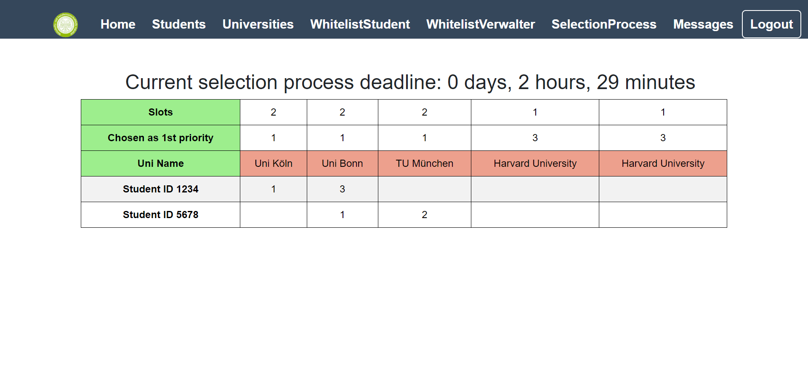
  </a>
</div>
<br>
Die Zahlen neben den Studenten ID's geben an, an welcher Stelle die Univeristät bezüglich der Präferenz des Studenten steht. Ist keine Präferenz für die jeweilige Universität gesetzt, so erscheint kein Wert in der jeweiligen Zelle.
<br>
Am Anfang wird diese Liste leer sein, wenn man noch keine Daten eingetragen hat. Alle Universitäts- und Studentendaten inklusive der Deadline, die auf den anderen Seiten eingetragen werden, erscheinen dann hier in Form dieser Tabelle.
<br>
Wurde die Deadline verlängert, indem in den letzten 15 Minuten des Auswahlprozesses eine Änderung der Präferenzen erfolgt ist, so wird dies hier kommuniziert und die exakte Deadline wird angezeigt.

### Students Page 
Auf dieser Seite kann man die Studenten hinzufügen und bearbeiten, die beim Auswahlverfahren teilnehmen können. Außerdem sieht man weitere wichtige Variablen wie zum Beispiel, ob ein Student der Datenschutzerklärung zugestimmt hat oder nicht("Accepted Policy"). 
<div align="center">
    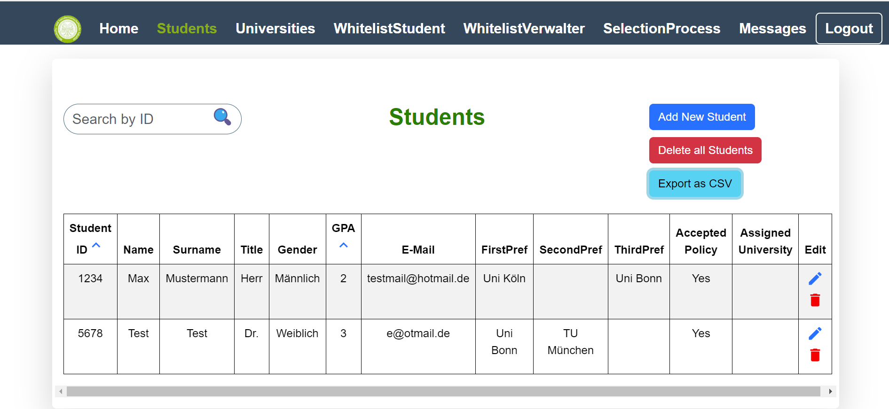
  </a>
</div>
Mit dem Exportbutton kann man die Studentendaten der Tabelle als CSV Datei exportieren und mit ihnen in Excel weiterarbeiten.
<br>
Wichtig beim Bearbeiten: Es kann beim Bearbeiten die ID des Studenten nicht mehr geändert werden, da die ID als eindeutige Identifikation dient und eine nachträgliche Änderung die Zuordnung der Daten durcheinander bringen würde. Alle anderen Variablen sind jedoch bearbeitbar:
<div align="center" style="margin-top: 20px;">
    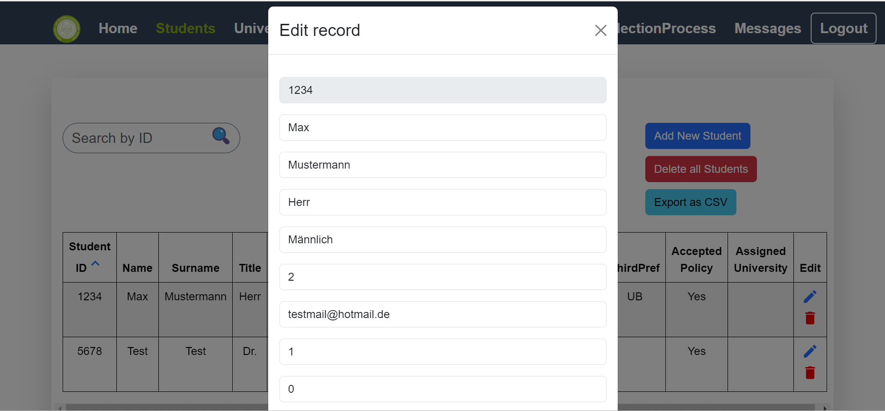
</div>
<br>
Die Präferenzen des Studenten für eine jeweilige Univeristät wird als ID der Universität gespeichert. Nur im Programm, was der Admin sieht, sieht man den Namen der Universität. Exportiert man die Daten als CSV-Datei , so wird bei dem Uninamen(unter FirstPref, SecondPref, ThirdPref sowie Assigned University) in Excel die ID der Uni ausgegeben und nicht der Name. Dadurch ist eine eindeutige Zuteilung der Universitäten gewährleistet. Die Namen der gewählten Univeristäten findet man also nur im Programm. Ist keine Universität für eine Präferenz gewählt, so erscheint der Wert 0 an dieser Stelle.
<br>
<br>
<br>

### Universities Page
Auf dieser Seite kann man die Universitäten, die der Student wählen kann, hinzufügen und bearbeiten. Auch können die Dateien hier im CSV-Datei exportiert werden.
<br>
Durch die Checkbox bei MinGPA kann man festlegen, ob die Durchschnittsnote der letzten Jahe für eine Univeristät auf der Studentenseite für die jeweilige Universität auf der Karte angezeigt werden soll oder nicht. 

<div align="center" style="margin-top: 20px;">
    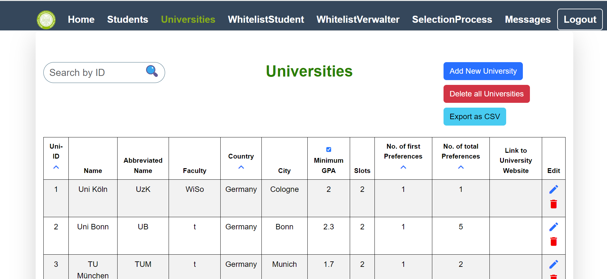
  </a>
</div>
<br>
<br>
<br>

### Whitelisten
Durch die Whitelisten ann der Admin den Zugriff auf das Tool steuern. Ist ein User(Student oder Admin) nicht in der Whitelist eingetragen, so hat dieser User keinen Zugriff auf das Tool. Dabei ist es wichtig, dass die Matrikelnummer bzw. die PKZ des Users die selbe ist wie die in der respektiven Tabelle(Student/Admin).
<div align="center" style="margin-top: 20px;">
    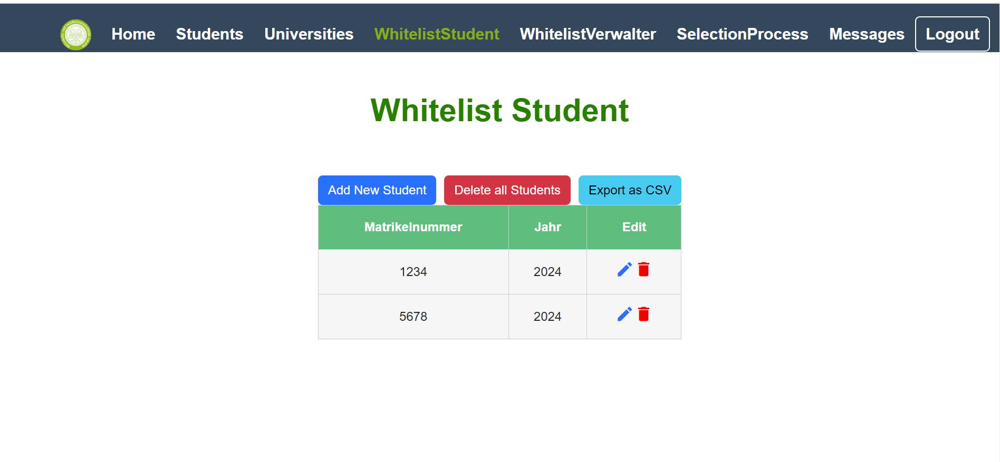
    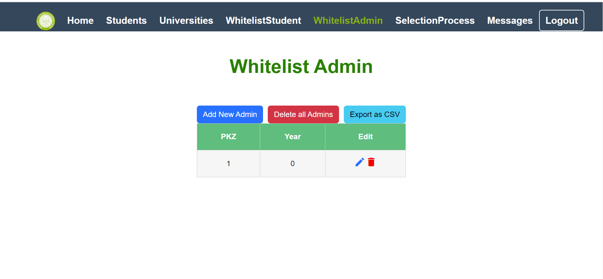
</div>
<br>
<br>
<br>


### SelectionProcess Page
Auf dieser Seite kann man einen Auswahlprozess starten und beenden. Man kann dort die verschiedenen Variablen festlegen, die für ein Auswahlverfahren wichtig sind. Nur wenn ein Auswahlverfahren gerade offen ist, kann der Student seine Präferenzen auf seiner Ansicht wählen. Ansosnten erscheint die Nachricht, dass kein Auswahlverfahren offen ist.
<div align="center" style="margin-top: 20px;">
    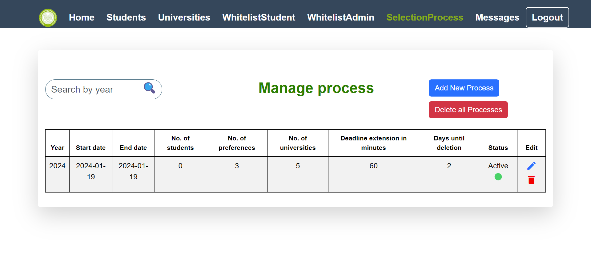
</div>
<br>
Das Jahr, das die Kohorte des aktuellen Auswahlrpozesses beschreibt, muss genau dem Startjahr entsprechen. Außerdem kann man beim ersten Erstellen eines Prozesses nicht die Variablen "No. of students" und "No. of preferences" festlegen: Diese werden automatisch festgelegt, indem die Daten aus der Datenbank gezogen werden. Danach kann man aber, wenn neue Studenten hinzugefügt werden, die Variable durch den Edit Button ändern.
<br>
"Die Deadline Extension in minutes" Variable gibt an, um wie viele Minuten sich die Deadline des Auswahlverfahrens nach hinten verschiebt, wenn eine Präferenzänderung seitens des Studenten in den letzten 15 Minuten des Auswahlverfahrens geschieht. Diese Variable muss mindestens 60 Minuten betragen und kann bis zu 1440 Minuten betragen(das heißt 1 Tag). Die Deadline verschiebt sich dann im gegebenen Fall um genau diesen Zeitpunkt nach hinten.
<br>
Auch hier ist eine Bearbeitung der Variablen möglich, jedoch nicht das Jahr, da dies die eindeutige Kennummer für den jeweiligen Prozess ist. Möchte man die einmal gesetzte Deadline bearbeiten, sodass das Jahr des Startdatums anders ist als bei der ersten Erstellung des Prozesses, so wird empfohlen, den Prozess zu löschen und dieses wieder zu starten. An den Präferenzen der Studierenden ändert sich dadurch nichts. Ist das neue Startdatum bzw. das neue Startjahr gleich, so kann man problemlos alle anderen Variablen ändern ohne einen neuen Prozess zu erstellen.
<br>
Wichtig: Es kann nur ein Prozess pro Zeitpunkt angelegt werden. Möchte man einen weiteren Prozess anlegen, so ist dies nicht möglich. Dadurch wird sichergestellt, dass das Programm stets weiß, um welchen Prozess es sich handelt, wenn man auf den anderen Seiten mit den Variablen des Prozesses weiterrechnet. Aufgrund Zeitmangels mussten wir uns für diese Option entscheiden. Wenn ein Auswahlverfahren vorbei ist und dieses nicht mehr aktiv ist, so wird es empfohlen, diesen Prozess zu löschen und dann einen neuen zu starten, wenn man ein neues Auswahlverfahren starten möchte.
<br>
<br>
<br>

### Messages Page
Auf dieser Seite kann man die Nachrichten festlegen, die ein Student nach dem Anmelden sieht. Dadurch kann dem Studenten wichtige Nachrichten sofort nach dem Anmelden angezeigt werden. Auch hier kann man die Nachrichten ebarbeiten, jedoch kann die ID(aufgrund der eindeutigen Zuordnung, die ansonsten durcheinander gebracht werden würde) nicht bearbeitet werden. Der Rest ist jedoch editierbar.
<div align="center" style="margin-top: 20px;">
   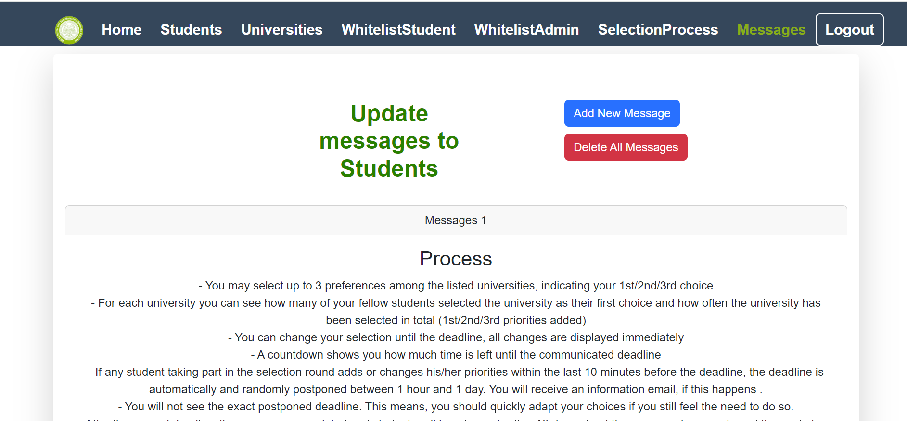
   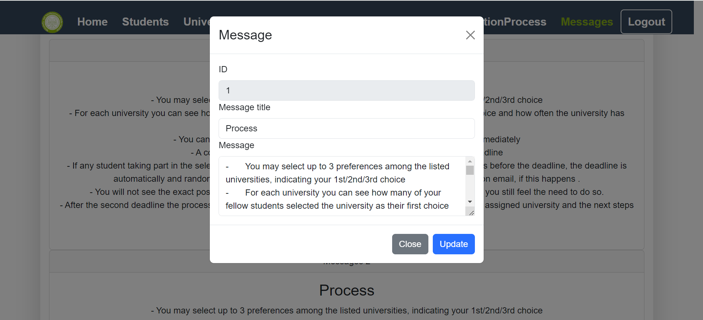
</div>


## Student
Der Student hat die Möglichkeit, auf einer eigenen Seite seine Präferenzen für eine Universität in absteigender Reihenfolge wählen und bearbeiten zu können. Beim ersten Anmelden muss dieser jedoch den Datenschutzerklärung des Verfahrens zustimmen, um am Auswahlverfahren teilnehmen zu können. Stimmt der Student dieser Datenschutzerklärung nicht zu, so kann er auch nicht am Auswahlverfahren teilnehmen und wird dementsprechend nicht auf die Homepage weitergeleitet. 
<br>
<div align="center" style="margin-top: 20px;">
   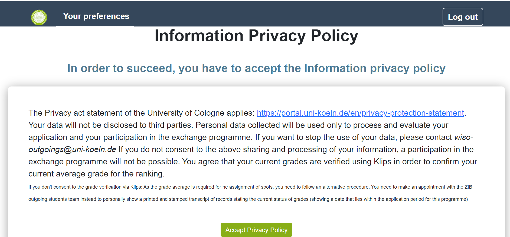
</div>
<br>
<br>

### Homepage des Studenten
Akzeptiert der Student die Datenschutzrichtlinien, so wird er auf der Homepage für den Studenten geleitet. Dort sieht man sofort die wichtigsten Nachrichten in Bezug auf das Auswahlverfahren. Diese Nachricht auf der Homepage des Studenten kann der Admin auf seiner Sicht auf der Seite "Messages" erstellen und bearbeiten. Gibt esm ehrere Nachrichten, so kann man sich mithilfe der Pfeile durchklicken.
<div align="center" style="margin-top: 20px;">
   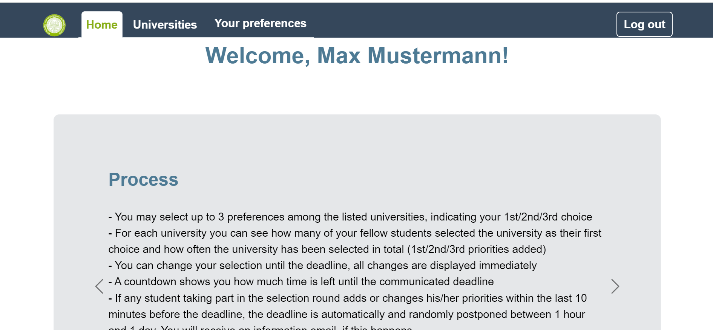
</div>

<br>
<br>
<br>

### Universities Page
Diese Seite ist das Herzstück des Tools.. Hier kann der Student seine Präferenzen für die Universitäten setzen. Zuerst sieht man die Deadline, die einem anzeigt, wie lange das Auswahlverfahren noch geht.
<div align="center" style="margin-top: 20px;">
   
</div>
<br>

Geht die Deadline zu Ende, so verschwindet die Seite und man erhält eine Nachricht ,dass zur Zeit kein Auswahlverfahren offen ist:
<div align="center" style="margin-top: 20px;">
   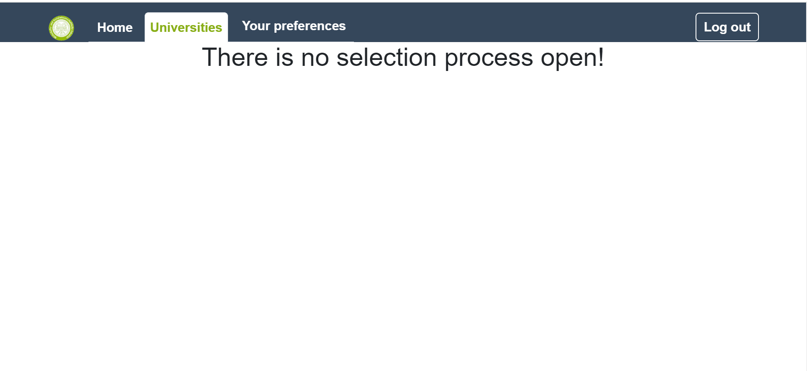
</div>

<br>
Als Student kann man hier seine Präferenzen für eine Universität setzen.
<div align="center" style="margin-top: 20px;">
   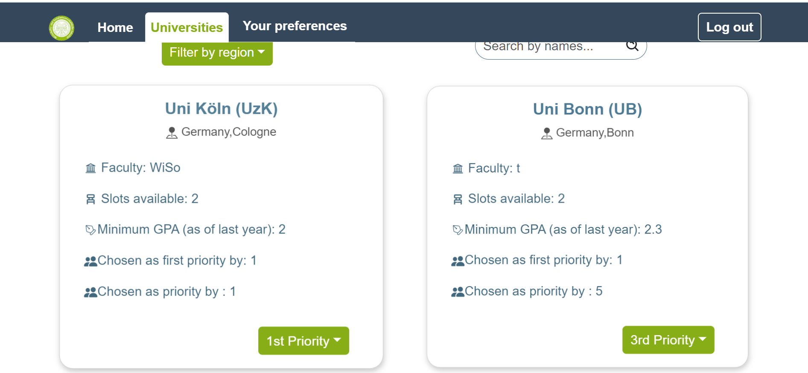
</div>
<br>
Ist bereits eine Präferenz für eine andere Universität belegt, so erscheint eine Fehlermeldung, dass die Präferenz bereits belegt ist. Außerdem wird das Dropdownmenü für eine Präferenz für 4 Sekunden ausgeschaltet, wenn man eine Präferenz gewählt hat, um ein "Spammen" der Datenbank zu vermeiden.
<br>
Wird die Deadline durch eine Präferenzänderung in den letzten 15 Minuten der Deadline ausgelöst, so erhält der Student die Informaiton, dass die Deadline verlängert wurde. Dieser sieht jedoch nicht, um wie viele Minuten die Deadline nach hinten verschoben wurde. Man erhält bei der Nachricht am Anfang lediglich die Information, dass der Zeitraum von 60 Minuten bis 1440 Minuten reicht.

<br>
<br>


### User Daten einfügen
Um die Software nutzen zu können, muss man sich als anmelden. Zuerst müssen die Benutzerdaten des Admns manuell in die Datenbank eingefügt werden. Nachdem man sich dann als Admin angemeldet haben, kann man in der Admin-Ansicht die Studentendaten in der Studenten Tabelle einfügen.

**Wichtig:** Diese Anwendung geht davon aus, dass Admins und Benutzer unterschiedliche Benutzernamen/IDs haben. Wenn beide Objekte der jeweiligen Benutzergruppe dieselbe ID haben, wird man als Student angemeldet, da die Software zuerst den Studenten überprüft.

#### Anfangsschritte für das Einfügen der Daten:

1. Verwende den Endpunkt [http://localhost:8081/admin](http://localhost:8081/admin), um die Daten für den Administrator einzufügen. Dies kann beispielsweise mit der Software Postman erfolgen. Die folgenden Variablen sind in dieser Tabelle vorhanden:
   - `uniKim`
   - `name`
   - `surname`
   - `title`
   - `sex`
   - `email`

**Wichtig:** Besonders wichtig ist `uniKim`, da dies für die Überprüfung des Benutzernamens beim Login verwendet wird. Der Rest der Variablen kann auf null bleiben, nur die uniKim ist wichtig.

2. Verwende den Endpunkt [http://localhost:8081/whitelistAdmin](http://localhost:8081/whitelistAdmin), um die pkz des Admins einzutragen. Dies kann ebenfalls mit Postman erfolgen. Die folgenden Variablen sind in dieser Tabelle vorhanden:
   - `pkz`
   - `year`

**Wichtig:** Hierbei ist vor allem `pkz` wichtig, da dies für die Überprüfung des Benutzernamens beim Login verwendet wird. Das Jahr kann frei bleiben, es wird dennoch empfohlen, dieses zu setzen.

Es ist hierbei wichtig, dass sowohl `uniKim` in `admin` als auch `pkz` in `whitelistAdmin` den gleichen Wert besitzen, da das Programm voraussetzt, dass der Admin in der Datenbank existiert und dieser auch in der Whitelist eingetragen ist.

3. Nun kann man sich als Admin anmelden. Dort kann man in der Seite "Students"(siehe oben) und in der Seite "WhitelistStudent" die Studentendaten einfügen. Auch hier muss die Matrikelnummer identisch sein, damit sich der Student anmelden kann.


<br>
<br>
<br>
<br>

### Beteiligte Personen/Entwicklerteam
* Luan Zekiri
* Ha Hong Nguyen
* Maria Carpet
<br>
<brS>

